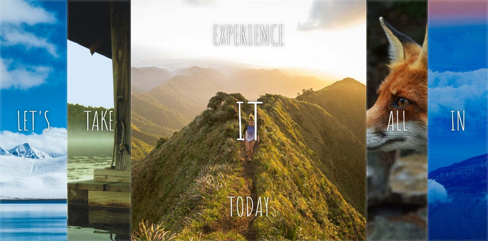
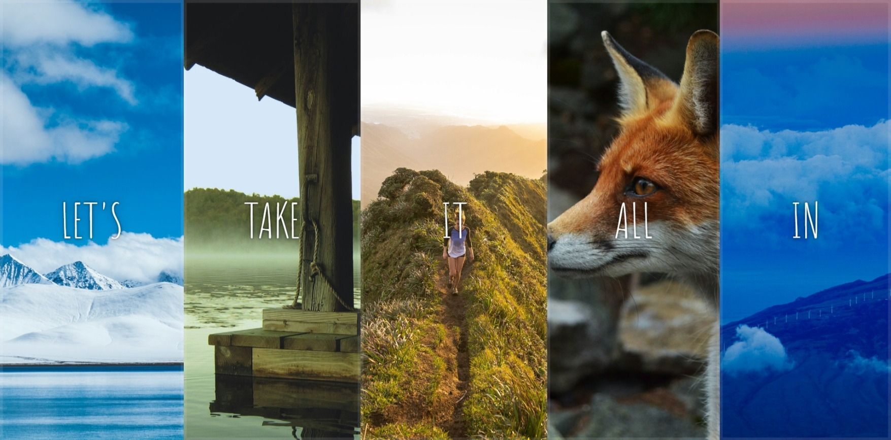

# 30 days JavaScript Challenge - Flex Panel Gallery Ssolution

This is a solution to the [Flex panel gallery challenge on 30 days js challenge series](https://courses.wesbos.com/account/access/65e08bd4a3eaa1a25e70b560/view/194130264).

## Table of contents

- [Overview](#overview)
  - [The challenge](#the-challenge)
  - [Screenshot](#screenshot)
- [My process](#my-process)
  - [Built with](#built-with)
  - [What I learned](#what-i-learned)
  - [Continued development](#continued-development)
  - [Useful resources](#useful-resources)
- [Acknowledgments](#acknowledgments)

## Overview

### The challenge

Users should be able to:

- Interact with Images present in the gallery
- Expand on clicking and undo on click again

### Screenshot




## My process

### Built with

- Semantic HTML5 markup
- CSS custom properties
- Flexbox
- Vanilla JavaScript

### What I learned

```css
.panel {
  transition:
    font-size 0.7s cubic-bezier(0.61,-0.19, 0.7,-0.11),
    flex 0.7s cubic-bezier(0.61,-0.19, 0.7,-0.11),
    background 0.2s;
}
```
Currently practicing to get better in animation.

### Continued development

- CSS Animation specially cubic-bezier
- Which animation is supposed to be appropriate in which area

### Useful resources

- [Stunning Images](https://unsplash.com/) - I really like the quality and free access to beautiful images.
- [Fonts](https://fonts.google.com/) - This is an amazing place to find best fonts for your projects.

## Acknowledgments

Huge shoutout to Wes Bos and the web-bros community for inspiring and supporting this innovative Flex Panel Gallery project in JavaScript!
